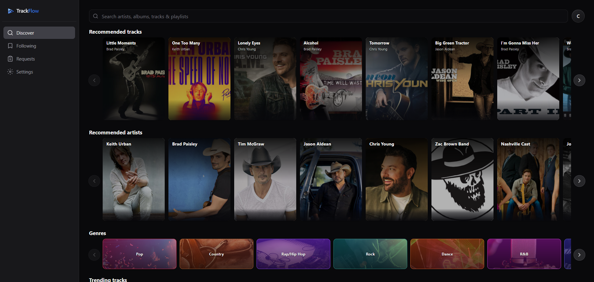
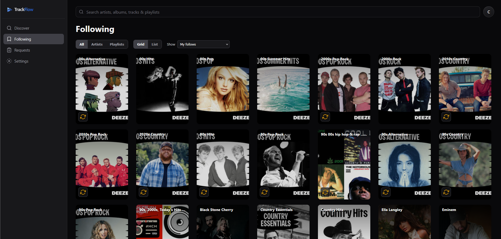
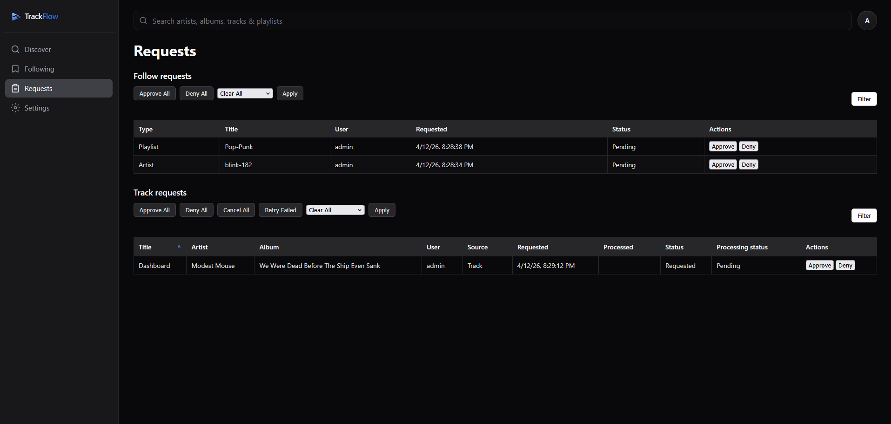
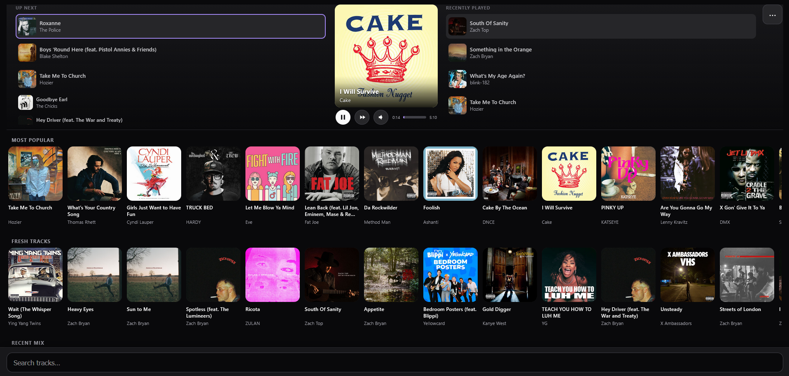

# TrackFlow

TrackFlow is a music discovery → acquisition engine that automatically builds and keeps your music library fresh.

Discover music. Follow what you like. TrackFlow handles the rest.

---

## 📸 Screenshots

---

## 🚀 What Makes TrackFlow Different

TrackFlow doesn’t just help you find music — it **continuously brings it into your library**.

- Follow an artist → automatically get their top tracks  
- Follow a playlist → keep it synced over time  
- Request tracks → auto-download and organize them  
- Sync to Plex → playlist available for playback in Plex  

It turns music discovery into a **fully automated pipeline**.

---

## 🔄 How It Works

1. Discover music (Deezer-powered search)  
2. Follow artists or Deezer playlists, or request tracks  
3. Tracks download automatically via slskd  
4. Files are processed and added to your library  
5. Sync to Plex (optional)  
6. New tracks continue to flow in over time  

---

## ⭐ Core Features

### 🎧 Discovery
- Search tracks, artists, albums, and playlists
- Recommendations from followed artists
- Play track previews
- Fast, track-first browsing

### 🔁 Follow System
- Follow artists → auto-track top tracks (now + future)  
- Follow playlists → auto-sync new tracks  
- Continuous, hands-off music acquisition  

### ⬇️ Automation
- Fully automated request → download → library pipeline  
- Smart matching and retry logic
- Optional manual track import

### 🎼 Plex Integration
- Sync followed playlists directly to Plex
- Recommendations based on Plex play history
- Plex authentication support for multi-user environments  

### 👥 Multi-User
- User requests  
- Optional admin approval workflow  
- Bulk actions  

### 🎛️ Jukebox Mode
- Locked-down guest interface  
- PIN-protected exit and controls 
- Host control panel  
- Ideal for parties or shared environments
- Touch-optimized controls for tablets

### 📱 Mobile/PWA-friendly interface
- App-like experience with install support (Add to Home Screen)
- Real-time updates without page reloads

---

## 🧠 Designed for Modern Listening

- Track-first, not album-first  
- Continuous discovery  
- Always evolving taste

TrackFlow keeps your music **alive and growing** instead of static.

---

## 🧩 What TrackFlow Is (and Isn’t)

**TrackFlow is:**
- A discovery engine  
- An acquisition pipeline  
- An automation layer  

**TrackFlow is not:**
- A media player (except jukebox mode)  
- A library manager  

---

## 📋 Requirements

- Docker (required)
- slskd instance (required)
- Soulseek account (required for slskd)

**Optional:**
- Plex server (for recommendations, playlist sync, and authentication)

---

## 🐳 Installation (Docker)

### Quick Start

    docker run -d \
      -p 3000:3000 \
      --name trackflow \
      celliodev/trackflow:latest

Open: http://localhost:3000

---

### Docker Compose (Recommended)

    services:
      trackflow:
        image: celliodev/trackflow:latest
        container_name: trackflow
        environment:
          - TZ=America/Chicago
          - TRACKFLOW_SQLITE_PATH=/appdata/trackflow.sqlite
          # Optional:
          # - TRUST_PROXY=1
          # - LIBRARY_PATH=/library/path
          # - SLSKD_LOCAL_DOWNLOAD_PATH=/download/path
          # - SESSION_SECRET=long_session_secret_key
        ports:
          - "3000:3000"
        volumes:
          - /opt/trackflow:/appdata
          - /data/path:/data
        restart: unless-stopped

Run:

    docker compose up -d

---

## 🎯 Goal

> Automatically discover, acquire, and maintain a music library that evolves with your taste.

---

## 🤝 Contributions

Pull requests are welcome.
